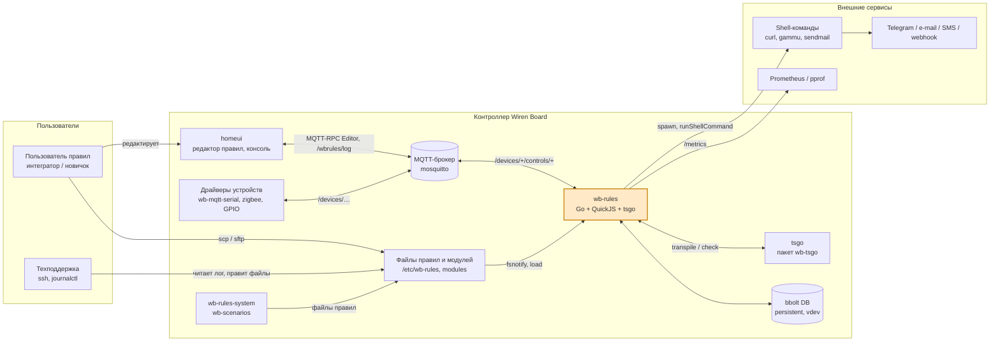

# 3. Контекст и границы системы

Граница системы — процесс `wb-rules` (включая встроенный QuickJS, `lib.js`, модули
`wb-notify`/`wb-alarms`, плагин `wbgo.so`) **плюс** редактор правил в homeui как
тесно связанный клиент. Всё остальное — внешние акторы и системы.

## 3.1. Бизнес-контекст

### Акторы и соседние системы

| Актор / система | Роль | Что получает от wb-rules | Что даёт wb-rules |
|---|---|---|---|
| **Пользователь правил** (интегратор, новичок) | пишет правила `.js`/`.ts` | автоматизация: реакция на события устройств, виртуальные устройства, уведомления; ошибки и подсказки в редакторе/логе | файлы правил — через редактор homeui либо напрямую по ssh/scp |
| **homeui (редактор правил)** | web-клиент на контроллере | список файлов, содержимое, ошибки загрузки с трейсбеком, вердикт проверки типов (`Editor.Check`), `.d.ts` контроллера (`Editor.GetTypes`), поток лога `/wbrules/log/+`, события `/wbrules/updates/+` | `Editor.Save/Rename/ChangeState/Remove` → запись файлов и live-перезагрузка; состояние устройств (для реестра `WbControls`) берёт из брокера сам |
| **MQTT-устройства и драйверы** (`wb-mqtt-serial`, zigbee2mqtt, GPIO, ADC, внешние брокеры) | источники событий и исполнители команд | записи в контролы (`/devices/<d>/controls/<c>/on`), произвольные `publish()` | значения и метаданные контролов (`/devices/+/controls/+`, `/meta/+`), retained-состояние |
| **wb-rules-system, wb-scenarios** | пакеты WB с системными правилами и сценариями | исполнение их ES5-файлов из `/usr/share/wb-rules-system/rules/`, виртуальные устройства, `Alarms` | файлы правил; обязаны быть совместимы и со stable-движком (Duktape) |
| **Notify / внешние сервисы** | Telegram Bot API, SMTP (`sendmail`), SMS (`gammu`/`wb-gsm`), webhooks | HTTP/SMS-запросы через `curl` и утилиты | коды возврата, вывод — в `Promise`/колбэк `spawn` |
| **Файлы правил и модулей** | `/etc/wb-rules/*.js[.disabled]`, `/etc/wb-rules-modules`, `/usr/share/wb-rules-modules`, `/usr/share/wb-rules/` | автозагрузка и перезагрузка по fsnotify, карантин при crash-loop | — |
| **Техподдержка** | ssh, `journalctl -u wb-rules`, консоль правил | строки `async rule error:`, `write ignored`, `[loadguard]`, `execution timed out` | правки файлов, `systemctl restart` |
| **Эксплуатация / мониторинг** | Prometheus, pprof | `/metrics` (длины очередей, таймеры, правила, буфер событий), `/debug/pprof` | — |

## 3.2. Технический контекст

### MQTT

| Канал | Направление | Назначение |
|---|---|---|
| `/devices/+/controls/+`, `/devices/+/controls/+/meta/+`, `/devices/+/meta/+` | подписка (драйвер `wbgo.so`, client id `rules`, `AllDevicesFilter`) | значения и метаданные контролов всех устройств → `ControlChangeEvent` |
| `/devices/<vdev>/controls/<c>`, `/devices/<vdev>/meta/*`, `/devices/<vdev>/controls/<c>/meta/*` | публикация (retained) | виртуальные устройства `defineVirtualDevice`, в т.ч. `wbrules` («Rule engine settings», контрол `Rule debugging`) |
| `/devices/<ext>/controls/<c>/on` | публикация | запись в контрол чужого устройства (`dev["d/c"] = v`, `setValue`) |
| `/wbrules/log/{debug,info,warning,error}` | публикация (QoS 1, не retained) | лог правил для консоли homeui; `debug` — только при включённом `Rule debugging` |
| `/wbrules/updates/{changed,removed}` | публикация | виртуальный путь изменённого/удалённого файла правил |
| `/rpc/v1/wbrules/Editor/<Method>/<clientId>[/reply]` | JSON-RPC поверх MQTT (`wbgong.MQTTRPCServer`, client id `wb-rules-engine`) | методы `List`, `Load`, `Save`, `Remove`, `Rename`, `ChangeState`, `Check`, `GetTypes`; спецификация `asyncapi.mqtt-rpc.yml`; коды ошибок 1000–1009 |
| произвольные топики | `trackMqtt(topic)` / `nextMqtt(topic)` — подписка; `publish(topic, payload)` — публикация | интеграция с не-WB топиками (retained при `nextMqtt` пропускаются) |

Брокер: `-broker` (по умолчанию `tcp://localhost:1883`, автоматически
`unix:///var/run/mosquitto/mosquitto.sock`, если сокет существует).

### Файлы и каталоги

| Путь | Назначение |
|---|---|
| `/etc/wb-rules/*.js`, `*.ts`, `*.disabled` | пользовательские правила (`-editdir` — корень виртуальных путей редактора) |
| `/usr/share/wb-rules-system/rules/`, `/usr/share/wb-rules/` | системные правила, `load_alarms.js` |
| `/usr/share/wb-rules-system/scripts/lib.js` | JS-библиотека движка (глобальный прототип realm'ов) |
| `/etc/wb-rules-modules`, `/usr/share/wb-rules-modules` (`WB_RULES_MODULES`) | CommonJS-модули для `require` |
| `/usr/share/wb-rules/types/wb-rules.d.ts` (`-ts-types`) | типы API; отдаётся редактору через `Editor.GetTypes` |
| `/var/lib/wirenboard/wbrules-persistent.db` (`-pdb`), `wbrules-vdev.db` (`-vdb`) | bbolt: `PersistentStorage`; значения виртуальных устройств (драйвер) |
| `/var/lib/wirenboard/wbrules-loadguard.json`, `wbrules-loading.marker` | состояние loadguard (каталог = `dirname(-pdb)`) |
| `/etc/default/wb-rules` (`WB_RULES_OPTIONS`), `/etc/wb-rules/alarms.conf` | параметры сервиса, конфиг алармов (схема confed `alarms.schema.json`) |
| `/tmp/wb-controls-*.d.ts` | временный реестр `WbControls` для фоновой проверки |
| `readConfig(path)` | чтение JSON-конфигов (с комментариями) из правил |

### Процессы и плагины

| Интерфейс | Описание |
|---|---|
| `/usr/lib/wb-rules/wbgo.so` (`-wbgo`) | Go-plugin драйвера (`wbgong.Init`): `Driver/DriverTx/Control/LocalDevice`, `DirWatcher` (fsnotify), `ContentTracker`, `MQTTRPCServer`, `MQTTClient` |
| `/usr/bin/tsgo --api --async` (`-tsgo`) | персистентный дочерний процесс: LSP-framed JSON-RPC `transpileModule` (ESNext, source map); respawn при транспортной ошибке, `Pdeathsig=SIGKILL`, I/O watchdog 15 с |
| `tsgo --noEmit --pretty false --target esnext --lib esnext --strict false --module esnext --moduleDetection force --allowJs --checkJs <files> wb-rules.d.ts /tmp/wb-controls-*.d.ts` | транзиентный процесс фоновой проверки; батч 300 мс, ≤2 одновременно, таймаут 60 с; вывод `path(line,col): error TSnnnn: msg` |
| `/bin/sh -c ...` | `spawn()`, `runShellCommand()`; `Notify` → `curl`, `/usr/sbin/sendmail -t`, `gammu`/`wb-gsm` |
| HTTP `-http 127.0.0.1:9090` | `/metrics` (Prometheus, VictoriaMetrics client), `/debug/pprof/*` |
| Сигналы | `SIGINT`/`SIGTERM` — корректное завершение; systemd `Restart=on-failure` |

### Что за границей

Не входят в систему и описываются только как соседи: брокер mosquitto и его ACL;
драйверы устройств; homeui за пределами редактора правил и консоли; сборка
`wbgo.so` (wbgo-private) и `tsgo` (wb-tsgo) — см. [§7](07-deployment-view.md);
инструменты разработчика на ПК (VS Code с `wb-rules.d.ts`, wb-mirta).
