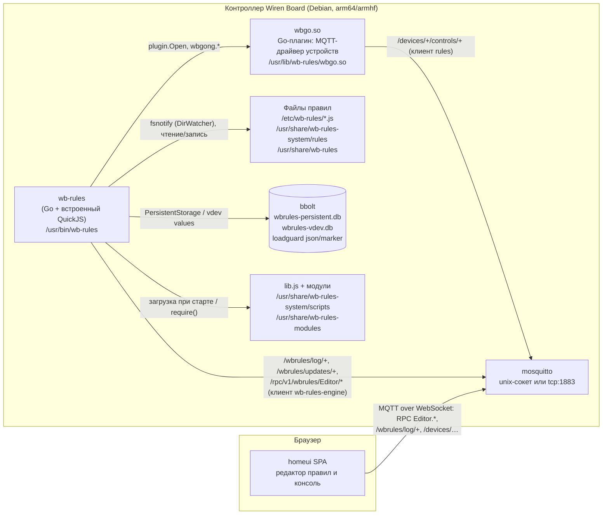
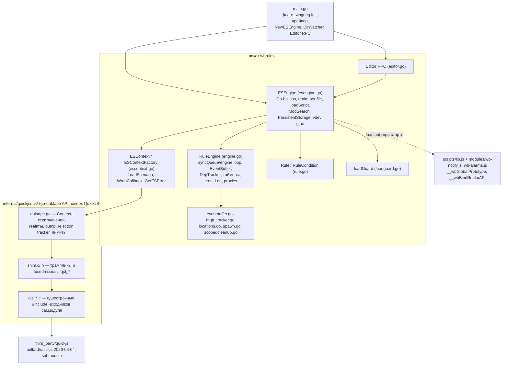
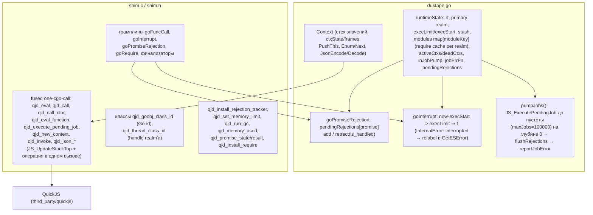

# 5. Строительные блоки

Раздел описывает статическую декомпозицию wb-rules (ветка `quickjs-core`): сначала контейнеры/процессы на контроллере, затем пакеты внутри процесса `wb-rules`, затем самый важный блок — шим `quickjsduk` — до уровня функций. Обоснования решений — в ADR (`см. ADR-NNN`).

## 5.1 Уровень 1: контейнеры и процессы

| Блок | Назначение | Ключевые идентификаторы | Интерфейсы |
|---|---|---|---|
| **wb-rules** (процесс) | Движок правил: загружает файлы, исполняет JS в одном потоке, реагирует на изменения контролов, ведёт таймеры/cron, публикует лог, обслуживает Editor RPC | `main.go`, пакет `wbrules`, `internal/quickjsduk`, `third_party/quickjs` | MQTT (два клиента: `rules` — драйвер, `wb-rules-engine` — лог/RPC), файлы, HTTP `-http` (`/metrics`, `/debug/pprof`) |
| **wbgo.so** | Закрытый драйвер устройств (wbgo-private): подписка `/devices/#`, локальные vdev, внешние устройства, `/on`-записи, DirWatcher, ContentTracker, MQTT-RPC сервер | `wbgong.Init`, `wbgong.Driver/DriverTx/Control/LocalDevice`, `NewDirWatcher`, `NewContentTracker`, `NewMQTTRPCServer` | Go plugin ABI (тот же toolchain и флаги `-trimpath -ldflags "-s -w"`) |
| **mosquitto** | Шина: контролы, лог правил, RPC редактора | `unix:///var/run/mosquitto/mosquitto.sock` (авто) или `tcp://localhost:1883` | топики `/devices/...`, `/wbrules/...`, `/rpc/v1/wbrules/Editor/...` |
| **Файлы правил** | Пользовательские (`/etc/wb-rules`, editable через `-editdir`) и системные правила; суффикс `.disabled` | regexp DirWatcher `(^|/)[^/.][^/]*\.js(\.disabled)?$` | fsnotify, Editor RPC |
| **bbolt БД** | `PersistentStorage` (`/var/lib/wirenboard/wbrules-persistent.db`, chmod 0640), значения vdev (`wbrules-vdev.db`), состояние loadguard рядом с pdb | `esPersistent*`, `SetPersistentDBMode`, `loadguard.go` | файловая система |
| **homeui SPA** | Редактор правил: список/загрузка/сохранение, консоль `/wbrules/log/+` | `frontend/src/pages/rules/**`, `frontend/src/stores/rules/**` | MQTT over WebSocket, RPC `wbrules/Editor` |

## 5.2 Уровень 2: внутри процесса wb-rules

### Пакет `wbrules`

| Блок | Назначение | Ключевые файлы / идентификаторы | Интерфейсы |
|---|---|---|---|
| **RuleEngine** | Драйвер-независимое ядро: однопоточный «engine loop» (`syncQueue`, `syncLoop`, `CallSync`/`MaybeCallSync`, `WhenEngineReady`), буфер событий (`EventBuffer`, `mainLoop` → `processEvents` → `RunRules`), DepTracker (`StartTrackingDeps`, `StoreRuleDeps`, `controlToRulesListMap`), таймеры (`StartTimer`, MIN_INTERVAL_MS=1), cron (`robfig/cron/v3`, `setupCron` при `Refresh()`), `DefineRule`/`DefineVirtualDevice`, `DeviceProxy`/`ControlProxy` (кэш по `rev`, `SetValueAt` → `UpdateValue` для vdev / `SetOnValue` для внешних), `Log(level,msg)` → `/wbrules/log/*`, vdev настроек `wbrules` («Rule debugging»), Prometheus-gauges `wbrules_engine_*` | `engine.go`, `eventbuffer.go`, `scopedcleanup.go` | `wbgong.Driver` (события `driverEventHandler`, транзакции), MQTT-клиент движка |
| **ESEngine** | Связка ядра с JS: `globalCtx` (прототипный realm), `localCtxs[path]`, Go-builtins (`esBuiltinFuncs`: `log`, `publish`, `_wbDefineRule`, `_wbStartTimer`, `_wbSpawn`, `readConfig`, `_wbPersistent*`, `defineVirtualDevice`, `getDevice/getControl`, `trackMqtt`, …), `prepareNewContext`, `loadScript`/`loadScriptAndRefresh`, `LiveWriteScript/LiveLoadFile/LiveRemoveFile`, `ModSearch` (CommonJS по `modulesDirs`, `module.static`), `esPersistent*` (bbolt), `esVdev*`/`esVdevCell*` прототипы | `esengine.go`, константы `__wbGlobalPrototype`, `__wbModulePrototype`, `_esThreads`, `_esModules`, `__esInitEnv`, `LIB_SYS_PATH` | `LocFileManager` (для Editor), `ContentTracker`, `loadGuard` |
| **ESContext / realm** | Обёртка над `duktape.Context` одного realm'а: `LoadScenario` (оборачивание в `async function F(module, exports)`, синтаксическая проверка, инспекция промиса, `PumpJobs`), `WrapCallback`/`invokeCallback` (колбэки в heap stash `_esCallbacks`), `GetESError` (разбор `.stack`, перевод строк `.ts`, relabel таймаута), `AddRule` (уникальность имён в файле), `invalidate()` | `escontext.go`, `ESContextFactory{preprocessor, lineTranslator, wrapPrologue}` | API шима `quickjsduk` |
| **Rule / DepTracker** | Правило и виды условий: `LevelTriggered` (when), `EdgeTriggered` (asSoonAs), `CellChanged` (whenChanged "dev/ctrl"), `FuncValueChanged`, `Or`, `Cron`, `Destroyed`; `Rule.Check(e)` регистрирует зависимости через `DepTracker` | `rule.go`, интерфейсы `DepTracker`, `Cron` | вызывается из `RunRules` |
| **Таймеры / cron** | `TimerEntry`, `fireTimer` на engine loop, `ctxTimers[*ESContext]` для очистки при reload; cron с секундами, `CronRuleCondition` | `engine.go`, `esWbStartTimer`, `handleTimerCleanup` | JS: `setTimeout/setInterval/startTimer/startTicker`, `cron("@every …")` |
| **Editor RPC** | MQTT-RPC сервис `wbrules`/класс `Editor`: `List`, `Load`, `Save`, `Remove`, `Rename`, `ChangeState`; коды ошибок 1000–1009; `validateScriptPath` (не с точки, `.js`, ≤255) | `editor.go`, `asyncapi.mqtt-rpc.yml` | `/rpc/v1/wbrules/Editor/<method>/<clientId>[/reply]` |
| **loadguard** | Защита от crash-loop при загрузке файла: маркер до `LoadScenario`, счётчик крашей, карантин после 3 до смены mtime | `loadguard.go`, `wbrules-loadguard.json`, `wbrules-loading.marker` | каталог `LoadGuardDir` (= `dir(-pdb)`) |
| **PersistentStorage** | `PersistentStorage(name,{global})`/`StorableObject` поверх bbolt; bucket'ы по файлу или глобальные; кэш `persistentDBCache` | `esPersistentSet/Get/Name`, `SetPersistentDBMode` | `/var/lib/wirenboard/wbrules-persistent.db` |
| **vdev / driver glue** | `defineVirtualDevice` → транзакция драйвера (`CreateDevice/CreateControl`), удаление при cleanup файла; `ControlProxy.SetValueAt` с логом «write ignored» (ADR-009) | `esDefineVirtualDevice`, `esVdev*`, `RuleEngine.DefineVirtualDevice` | `wbgong.DriverTx` |
| **Прочее** | `mqtt_tracker.go` (`trackMqtt`, replay retained), `locations.go` (`LocFileEntry{Enabled, Error, VirtualPath, Rules, Devices, Timers}`, `ScriptError`), `spawn.go` (`exec.Command`, `SpawnFunc` подменяется в тестах), `strings.go` | — | — |

### Прочие блоки процесса

| Блок | Назначение | Ключевые файлы / идентификаторы | Интерфейсы |
|---|---|---|---|
| **internal/quickjsduk** | Реализация используемого wb-rules стек-API go-duktape (~90 методов) поверх QuickJS (`replace github.com/wirenboard/go-duktape => ./internal/quickjsduk`, ADR-003) | `duktape.go`, `shim.c/.h`, `qjs_*.c`, тесты `duktape_test.go`, `memlimit_test.go`, `exectimeout_test.go`, `leak_test.go` | cgo; CFLAGS `-I${SRCDIR}/../../third_party/quickjs` |
| **third_party/quickjs** | Сабмодуль bellard/quickjs @ `3d5e064` (релиз 2026-06-04), без патчей (ADR-002) | ADR-002, ADR-003 | исходники включаются через `qjs_*.c` |
| **scripts/lib.js** | JS-библиотека рантайма: загружается один раз в `globalCtx`, глобал становится `__wbGlobalPrototype`; `_WbRules{defineRule, startTimer, makePersistentStorage, …}`, `dev`-Proxy, `defineAlias`, `cron`, `Notify`, `Alarms`; `__wbBindRealmAPI(g)` компилируется в каждом realm'е (`defineRule`, таймеры, `spawn`, `runShellCommand`, `sleep`, `changed`, `nextMqtt`, `PersistentStorage`, ADR-007) | `scripts/lib.js`, `modules/wb-notify.js`, `modules/wb-alarms.js`, `rules/load_alarms.js` | Go-builtins `_wb*`; `require()` |

## 5.3 Уровень 3: шим `internal/quickjsduk`

- **Что имитирует.** Публичный API `go-duktape` (стек индексов, `PushGlobalObject`, `GetPropString`, `PutPropString`, `PushGoFunc`, `Pcall`, `PcallProp`, `PcompileStringFilename`, `PushHeapStash`, `PushThreadNewGlobalenv`, `Enum/Next`, CommonJS `require` + `Duktape.modSearch`, точные строки ошибок вида `Error: error error (rc -100)`). Код `wbrules/` почти не изменился при смене движка (см. ADR-003).
- **Realm'ы.** `NewContext()` = `JS_NewRuntime` + primary `JSContext` + `require` + rejection tracker; `PushThreadNewGlobalenv()` → `qjd_new_context` (новый realm, объект-handle класса `qjd_thread_class_id`; освобождение handle'а GC ⇒ `reapDeadContexts`). QuickJS передаёт Go-функции realm вызывающего кода (который может быть уже выгружен), а Duktape исполнял их в контексте вызывающего треда, поэтому шим ведёт стек активных realm'ов (`pushActive/popActive`) и диспатчит вызов в realm, исполняющий JS сейчас. См. ADR-004.
- **Fused-вызовы.** Горутины Go мигрируют между OS-потоками между cgo-вызовами; эвристика стека QuickJS требует `JS_UpdateStackTop` и глубокую операцию в ОДНОМ C-вызове (`qjd_eval`, `qjd_call`, …), иначе ложный «stack overflow». Якорь ставится только на внешнем входе: вложенный вход (JS → Go-builtin → JS) работает на стеке внешнего, и повторный якорь снял бы проверку переполнения (защита от JS↔Go-рекурсии: RangeError после 200 вложенных входов).
- **Pump.** `Pcall` после возврата из JS на глубине 0 вызывает `pumpJobs()`; `PcallNoPump` + `PumpJobs()` — разделённый вариант для инспекции промиса загрузки (`PromiseStateTop`, `PushPromiseResultTop`, `RetractTopPromiseRejection`). Ошибка pump'а — `reportJobError` → `jobErrFn` (движок: `async rule error: …`). См. ADR-005.
- **Rejection tracker.** `JS_SetHostPromiseRejectionTracker` → `goPromiseRejection`: необработанный rejection попадает в `pendingRejections`, при `is_handled` в том же ходу — убирается; `flushRejections` после дренажа сообщает оставшиеся.
- **Лимиты.** `SetExecutionTimeLimit` (interrupt handler, окно на внешний вход и на каждый promise job; сообщение о таймауте подставляется по тексту исключения и флагу прерывания), `SetMemoryLimit` → `JS_SetMemoryLimit` на весь runtime (ADR-008); `MemoryUsed()`/`RunGC()` — канарейки для leak-тестов.
