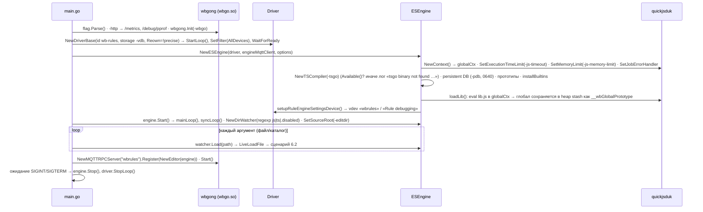
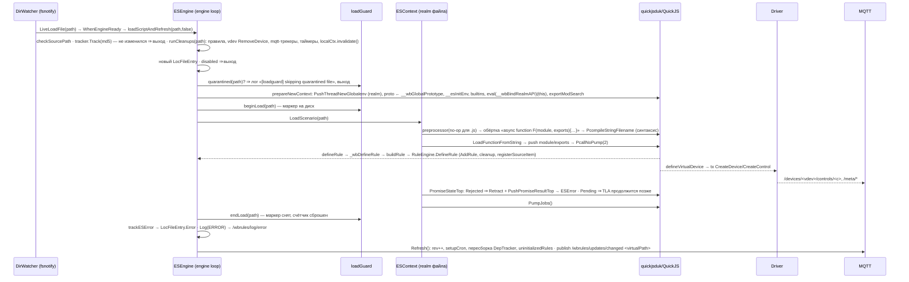
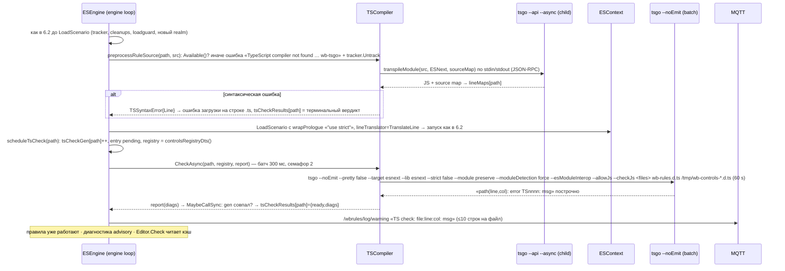
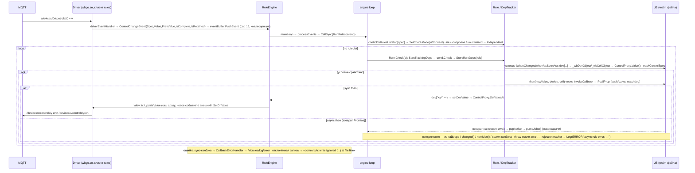
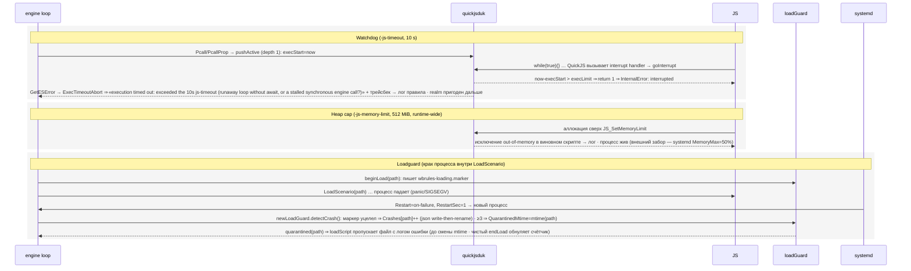
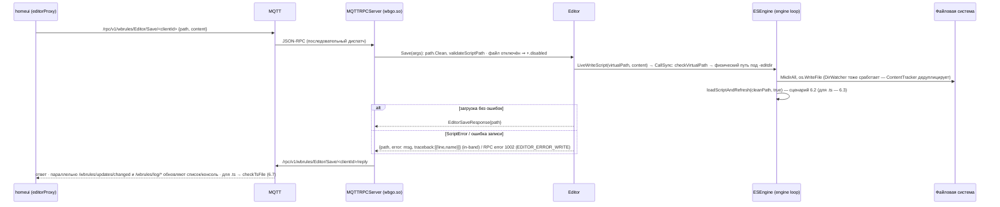
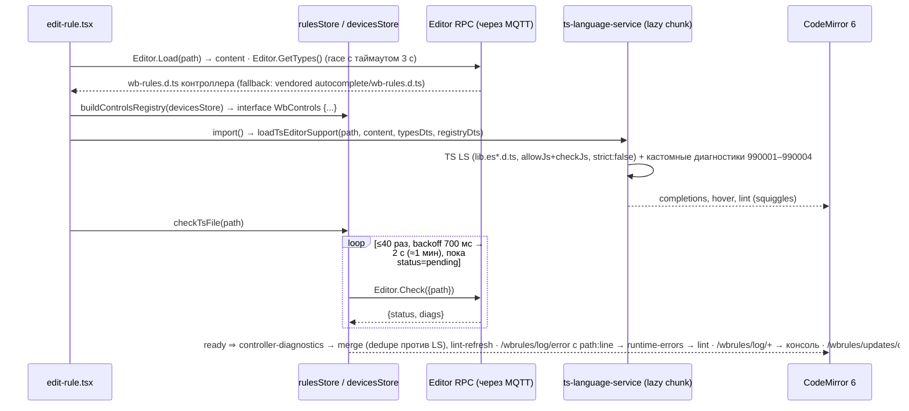

# 6. Представление времени выполнения

Сценарии ниже показывают, как блоки из §5 взаимодействуют в ключевых ситуациях. Везде действует инвариант: весь JS исполняется на одной горутине («engine loop», `syncQueue` → `syncLoop`), остальные горутины (драйвер, таймеры, RPC, tsgo-проверки) лишь ставят замыкания в очередь через `CallSync`/`MaybeCallSync`.

## 6.1 (g) Старт процесса

1. Флаги → `-http` (метрики, pprof) → `wbgong.Init(wbgo.so)`; при дефолтном `-broker` и наличии `/var/run/mosquitto/mosquitto.sock` — переключение на unix-сокет.
2. Драйвер (MQTT-клиент `rules`) стартует и ждёт готовности; затем `NewESEngine`: лимиты и обработчик async-ошибок ставятся на `globalCtx` (runtime-wide), далее prototypes, builtins, `lib.js`, vdev настроек. Проба tsgo — только лог (ADR-011); персистентный `tsgo --api --async` стартует лениво при первой транспиляции `.ts`.
3. `engine.Start()` запускает `mainLoop` (ждёт `driverReadyCh`) и `syncLoop`; DirWatcher загружает файлы; при `-editdir` регистрируется Editor RPC — уже после загрузки всех файлов.

## 6.2 (a) Загрузка / перезагрузка `.js`

1. Источник — fsnotify (DirWatcher в wbgo-private) или `watcher.Load` при старте; всё на engine loop. `ContentTracker` (md5) отсекает неизменённое содержимое (кроме `loadIfUnchanged=true` от `LiveWriteScript`).
2. `runCleanups(path)` снимает всё, что файл создал раньше: правила, vdev (удаляются и создаются заново), `trackMqtt`, таймеры; старый realm помечается `invalid` (поздние колбэки пропускаются). Карантин loadguard проверяется до создания realm'а (см. 6.5).
3. Новый realm: глобал файла наследует `__wbGlobalPrototype` (lib.js), realm-локальные builtins и `__wbBindRealmAPI` (ADR-004, ADR-007).
4. Файл всегда оборачивается в `async function F(module, exports)` (ADR-006): синхронная ошибка = отклонённый промис ⇒ ошибка загрузки; `await` верхнего уровня оставляет промис pending. `Refresh()` пересобирает зависимости и cron и публикует `/wbrules/updates/changed`.

## 6.3 (b) Загрузка `.ts`

1. Транспиляция — «run first, check later» (ADR-010): ~1 мс на файл через персистентный дочерний процесс; source map даёт таблицу строк, трейсбеки указывают на `.ts`. Отсутствие tsgo — ошибка загрузки; `loadScript` снимает файл с дедупликации (`Untrack`), чтобы повтор сработал, когда tsgo появится.
2. Фоновая проверка батчится (0.27 с/файл против 0.34 с на 20 файлов) и ограничена двумя процессами; реестр контролов передаётся временным `.d.ts` (ADR-014). Результат — в лог правил и в кэш `Editor.Check`; `.js` проверяются тоже (`--checkJs`), но advisory (ADR-012).

## 6.4 (c) Изменение контрола → правило → запись

1. Драйвер принимает публикацию своим MQTT-клиентом; `EventBuffer` коалесцирует всплески. `RunRules` выбирает кандидатов по зависимостям, записанным при прошлых проверках (DepTracker), плюс правила без контролов и неинициализированные; каждая проверка условия заново фиксирует прочитанные контролы.
2. Запись в локальный vdev обновляет кэш немедленно и порождает новое событие; запись во внешнее устройство идёт в `/on`-топик, кэш обновится по эху. Отказ драйвера (неверный тип) — только лог (ADR-009).
3. Async-колбэк: после первого `await` управление возвращается в Go, шим дренирует микрозадачи; дальнейшие шаги выполняются из других входов в JS на той же горутине (ADR-005).

## 6.5 (d) Watchdog, ограничение кучи, карантин loadguard

1. Watchdog измеряет wall-time одного синхронного входа в JS или одного promise job (каждый job — своё окно `jobStart`); срабатывание — обычное JS-исключение с понятным текстом, другие правила работают дальше (ADR-008). Лимит кучи общий для всех realm'ов (ADR-004): аллокационная бомба даёт catchable OOM, а не смерть процесса.
2. Loadguard защищает от crash-loop «файл падает при каждой загрузке → systemd перезапускает → Editor RPC недоступен»: после трёх подряд крахов файл пропускается до редактирования.

## 6.6 (e) Editor.Save из homeui

1. RPC обслуживается горутиной сервера wbgo.so; `Save` блокируется на `LiveWriteScript` до завершения загрузки на engine loop. Ошибка скрипта возвращается в теле ответа (редактор показывает её у строки), системная — кодом RPC.
2. Сохранение = запись + принудительная перезагрузка (`loadIfUnchanged=true`), включая удаление/пересоздание vdev (гонка драйвера исправлена в wbgo-private #100).

## 6.7 (f) Редактор homeui: типы, реестр, language service, опрос Editor.Check

1. Типы берутся с контроллера (`GetTypes`), vendored-копия — fallback для старых прошивок (ADR-015); реестр контролов строится из `devicesStore` — тот же приём, что `controlsRegistryDts` на контроллере (ADR-014).
2. Локальная диагностика мгновенна; авторитетный вердикт контроллера приходит опросом `Editor.Check` и показывается инлайн с дедупликацией (ADR-016 — кастомные проверки «забытого await» вместо ESLint).
