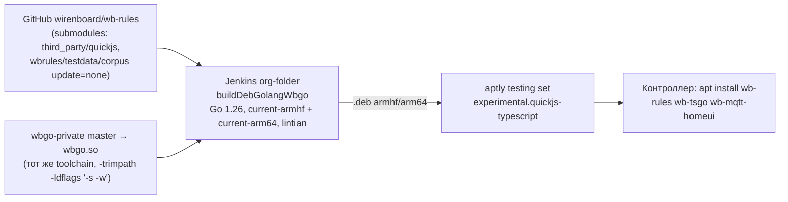

# 7. Представление развёртывания

## 7.1 Обзор

```mermaid
graph TB
    subgraph CTRL["Контроллер Wiren Board — Debian (arm64 WB7/WB8, armhf WB6)"]
        subgraph PKG_RULES["deb: wb-rules (Depends: wb-tsgo)"]
            BIN["/usr/bin/wb-rules"]
            SO["/usr/lib/wb-rules/wbgo.so"]
            LIBJS["/usr/share/wb-rules-system/scripts/lib.js"]
            MODS["/usr/share/wb-rules-modules/*.js"]
            DTS["/usr/share/wb-rules/types/wb-rules.d.ts"]
            ALARM["/usr/share/wb-rules/load_alarms.js<br/>/etc/wb-rules/alarms.conf + confed-схема"]
            UNIT["systemd: wb-rules.service<br/>wb-rules-alarms-reloader.service"]
            CFG["/etc/wb-rules/rules.js<br/>/etc/wb-configs.d/13wb-rules (wb_move)"]
        end
        subgraph PKG_TSGO["deb: wb-tsgo (pure Go, статический)"]
            TSGO["/usr/bin/tsgo"]
        end
        subgraph PKG_SYS["deb: wb-rules-system"]
            SYSRULES["/usr/share/wb-rules-system/rules/*.js"]
        end
        subgraph PKG_UI["deb: wb-mqtt-homeui"]
            SPA["статика SPA (nginx)"]
        end
        MOSQ["mosquitto<br/>/var/run/mosquitto/mosquitto.sock, :1883, WebSocket"]
        VAR[("/var/lib/wirenboard/<br/>wbrules-persistent.db, wbrules-vdev.db,<br/>wbrules-loadguard.json, wbrules-loading.marker")]
        ETC["/etc/wb-rules/*.js|*.ts (editable)<br/>/etc/wb-rules-modules<br/>/etc/default/wb-rules"]
        HTTP["127.0.0.1:9090 /metrics, /debug/pprof"]
    end
    subgraph BROWSER["Браузер пользователя"]
        UI["homeui SPA<br/>+ ленивый TS-чанк (~1 MB gzip)"]
    end
    BIN -- plugin.Open --> SO
    BIN -- exec --> TSGO
    BIN --> MOSQ
    BIN --> VAR
    BIN --> ETC
    BIN --> SYSRULES
    BIN --> HTTP
    SPA -. загрузка .-> UI
    UI -- "MQTT over WebSocket" --> MOSQ
```



## 7.2 Контроллер

### Пакеты

| Пакет | Содержимое | Примечания |
|---|---|---|
| `wb-rules` (`3.0.0~quickjs2`) | `/usr/bin/wb-rules`, `/usr/lib/wb-rules/wbgo.so`, `lib.js`, модули `wb-notify.js`/`wb-alarms.js`, `wb-rules.d.ts`, `load_alarms.js`, `alarms.conf` + `alarms.schema.json`, `/etc/wb-rules/rules.js`, `/etc/wb-configs.d/13wb-rules`, два systemd-юнита | `Depends: ${shlibs:Depends}, wb-tsgo` (ADR-011); `Breaks` старых `wb-mqtt-confed`, `wb-rules-system`, `wb-mqtt-dac`; `Build-Depends: golang-1.26-go:native`; dh-сборка, `dh_builddeb -Zgzip` |
| `wb-tsgo` | `/usr/bin/tsgo` — немодифицированный typescript-go (pure Go, `CGO_ENABLED=0`, `GOARM=6` для armhf) | отдельный репозиторий wirenboard/wb-tsgo; порядок configure гарантирует наличие до старта wb-rules |
| `wb-rules-system` | системные правила `/usr/share/wb-rules-system/rules/*.js` (должны оставаться ES5 — совместимость со stable 2.46.x) | загружаются первыми по порядку аргументов юнита |
| `wb-mqtt-homeui` | SPA; `Recommends: wb-rules (>= 3.0.0~quickjs2~~)` — на старом движке деградирует (GetTypes fallback, Check → `unsupported`) | — |

### Файлы и каталоги

| Путь | Назначение |
|---|---|
| `/etc/wb-rules/` | редактируемые правила (`-editdir`), `.js`/`.ts`, суффикс `.disabled`; `wb_move` в `wb-configs` |
| `/usr/share/wb-rules-system/rules/`, `/usr/share/wb-rules/` | системные правила, `load_alarms.js`, `types/` (каталог отслеживается DirWatcher — `.d.ts` загружается как заглушка) |
| `/etc/wb-rules-modules`, `/usr/share/wb-rules-modules` | `require()`-модули (`WB_RULES_MODULES`, выставляется юнитом) |
| `/usr/share/wb-rules-system/scripts/lib.js` | JS-рантайм (`LIB_SYS_PATH`) |
| `/var/lib/wirenboard/wbrules-persistent.db` | bbolt `PersistentStorage` (0640) |
| `/var/lib/wirenboard/wbrules-vdev.db` | значения vdev (драйвер) |
| `/var/lib/wirenboard/wbrules-loadguard.json`, `wbrules-loading.marker` | состояние loadguard (каталог = `dir(-pdb)`) |
| `/etc/default/wb-rules` | `WB_RULES_OPTIONS` (дополнительные флаги) |
| `/tmp/wb-controls-*.d.ts` | временный реестр контролов для `tsgo --noEmit` |

### systemd-юнит `wb-rules.service`

```
After=wb-hwconf-manager.service wb-modules.service mosquitto.service
Environment="WB_RULES_MODULES=/etc/wb-rules-modules:/usr/share/wb-rules-modules"
EnvironmentFile=-/etc/default/wb-rules
ExecStart=/usr/bin/wb-rules $WB_RULES_OPTIONS -http 127.0.0.1:9090 -syslog -editdir '/etc/wb-rules/' \
          '/usr/share/wb-rules-system/rules/' '/etc/wb-rules/' '/usr/share/wb-rules/'
Restart=on-failure  RestartSec=1  User=root
MemoryHigh=30%  MemoryMax=50%
```

`wb-rules-alarms-reloader.service` (`--no-start`, без рестарта при обновлении) «трогает» `load_alarms.js` при изменении `alarms.conf` через confed.

### Флаги CLI (значения по умолчанию из `main.go`)

| Флаг | По умолчанию | Смысл |
|---|---|---|
| `-broker` | `tcp://localhost:1883` (автопереключение на `unix:///var/run/mosquitto/mosquitto.sock`, если сокет есть) | адрес брокера |
| `-editdir` | `""` | корень редактируемых файлов; включает Editor RPC |
| `-debug`, `-mqttdebug`, `-syslog` | off | отладка / лог в syslog |
| `-debug-queues` | off | драйвер без очередей + `SetTesting` (тесты) |
| `-precise` | off | не перехватывать устройства без драйвера (`ReownUnknownDevices=!precise`) |
| `-cleanup` | off | удалять MQTT-данные при выгрузке |
| `-http` | `""` (юнит: `127.0.0.1:9090`) | Prometheus `/metrics` (VictoriaMetrics `metrics`) + `net/http/pprof` |
| `-pdb` | `/var/lib/wirenboard/wbrules-persistent.db` | БД PersistentStorage; `""` отключает и БД, и loadguard |
| `-vdb` | `/var/lib/wirenboard/wbrules-vdev.db` | БД значений vdev |
| `-wbgo` | `/usr/lib/wb-rules/wbgo.so` | путь к плагину |
| `-tsgo` | `/usr/bin/tsgo` | компилятор TS; `""` — `.ts` отвергаются |
| `-ts-types` | `/usr/share/wb-rules/types/wb-rules.d.ts` | декларации для проверки и `Editor.GetTypes` |
| `-js-timeout` | `10s` (`DEFAULT_JS_EXECUTION_LIMIT`) | watchdog синхронного входа / promise job; `0` — off |
| `-js-memory-limit` | `536870912` (512 MiB) | лимит кучи QuickJS на процесс; `0` — off |
| позиционные | — | файлы/каталоги правил; `wb-rules version` печатает версию |

Процессы на контроллере во время работы: `wb-rules` (1 процесс, один JS-поток), дочерний `tsgo --api --async` (ленивый, персистентный, `Pdeathsig=SIGKILL`), до 2 транзиентных `tsgo --noEmit …`, а также процессы `spawn()/runShellCommand()` (`/bin/sh -c`), `curl`, `sendmail`, `gammu`/`wb-gsm` из модуля `Notify`.

## 7.3 Браузер (homeui)

- SPA из пакета `wb-mqtt-homeui` отдаётся веб-сервером контроллера; соединение с брокером — MQTT over WebSocket.
- Редактор правил грузит базовый бандл, а TypeScript language service (`typescript`, `@typescript/vfs`, `@valtown/codemirror-ts`) — отдельным ленивым чанком (~1 MB gzip) при открытии файла (ADR-015; ESLint отклонён из-за +2–4 MB, ADR-016).
- Типы приходят с контроллера (`Editor.GetTypes`, таймаут 3 с), иначе — vendored `autocomplete/wb-rules.d.ts` (ADR-013). Версии TS различаются: 6.0.3 в браузере и 7.1-dev (tsgo) на контроллере.

## 7.4 CI и доставка



- `Jenkinsfile`: `buildDebGolangWbgo defaultTargets: 'current-armhf current-arm64', defaultGoVersion: '1.26', defaultRunLintian: true`. Только Jenkins, без GitHub Actions.
- Кросс-сборка: `CGO_ENABLED=1`, `CC=arm-linux-gnueabihf-gcc` / `aarch64-linux-gnu-gcc`, `-trimpath -ldflags "-s -w"`, для arm64/armhf `-extldflags=-fuse-ld=bfd` (binutils ≥ 2.44 без gold). QuickJS компилируется cgo через обёртки `internal/quickjsduk/qjs_*.c` (ADR-002) — без системной библиотеки.
- `wbgo.so` собирается в CI из master `wbgo-private` и должен совпадать с бинарём по версии Go и флагам, иначе `plugin.Open` отказывает. Риск расхождения версий драйвера и движка между сборками.
- Корпус (`wbrules/testdata/corpus`, приватный, `update = none`) на CI не гоняется: `TestCorpus` пропускается без каталога; всегда выполняется `TestCorpusExample`.
- Доставка на тестовые контроллеры — только через deb из testing set `quickjs-typescript` (глобы `*~exp~quickjs+ts~*`), не rsync.

## 7.5 Окружение разработчика

- Требования: Go 1.26 (должен совпадать с wbgo.so), gcc (cgo), `git clone --recursive` (сабмодуль QuickJS), бинарь tsgo для TS-тестов.
- Тесты: `cp amd64.wbgo.so wbrules/wbgo.so && go test -v -cover ./wbrules` (цель `make test`); `wbgo.so` для тестов собирается без `-trimpath` — пара «тесты + плагин» должна совпадать.
- Сьюты `RuleTypeScript`, `NoTsgo/LateTsgo` берут компилятор из `WB_RULES_TSGO` или установленного `/usr/bin/tsgo` (иначе skip); `WB_RULES_CORPUS`, `WB_RULES_CORPUS_REQUIRED=1`, `WB_RULES_CORPUS_UPDATE=1`, `WB_RULES_CORPUS_SHARD` управляют корпусом (`make corpus` выкачивает сабмодуль).
- `-race` требует race-сборки `wbgo.so`; TSAN падает на сьютах с интенсивным churn'ом heap'ов (ADR-003). Режим `DEBUG=1` в Makefile отключает `-trimpath`/`-s -w` и добавляет `-failfast`.
- `dpkg-buildpackage clean` удаляет `wbrules/wbgo.so`; `-trimpath` лишает `runtime.Caller` путей — `testModulesDir` имеет fallback.
- Замена `wbgo.so` на живом контроллере: только stop → swap → start (копирование поверх mmap-нутого .so даёт SIGBUS).
