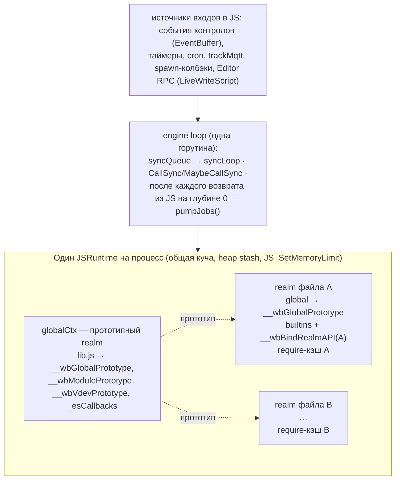
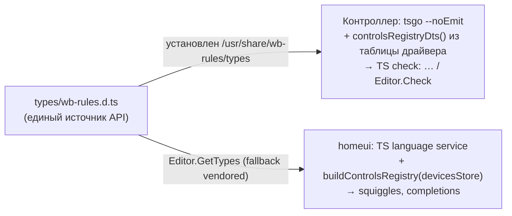

# 8. Сквозные концепции

Правила и решения, действующие сразу во многих блоках из §5: модель исполнения, ошибки и лог, лимиты, перезагрузка, конфигурация, совместимость, типизация, тестирование, безопасность, наблюдаемость. Обоснования — в ADR (`см. ADR-NNN`).

## 8.1 Изоляция и модель выполнения

- **Один поток.** Весь JS — на engine loop; драйвер, таймеры, RPC и tsgo-проверки только ставят замыкания в `syncQueue` (`CallSync` с таймаутом 120 с в debug-режиме — предупреждение, не panic; `MaybeCallSync` — не блокирует после `Stop`). Зависший синхронный цикл в одном файле блокирует все правила — отсюда watchdog (8.3).
- **Runtime и realm.** Общая куча + по одному `JSContext` (realm) на файл правил (`PushThreadNewGlobalenv`, handle в stash `_esThreads[path]`); глобал файла наследует `__wbGlobalPrototype` (lib.js); кэш модулей per-realm — и `require()`-кэш, и `ctx->loaded_modules` QuickJS для ES-модулей (модуль инициализируется в каждом файле; внутри файла `require("x")`, `import "x"` и `import "/abs/x.js"` — один экземпляр); `module.static`/`import.meta.static` и `PersistentStorage(name,{global:true})` — явные каналы обмена; `global.__proto__` — escape hatch. Это «cooperative namespacing», не security boundary (ADR-004).
- **Атрибуция после `await`.** Realm-чувствительные API (`defineRule`, таймеры, `spawn`, `sleep`, `changed`, `nextMqtt`, `PersistentStorage`) компилируются в каждом realm'е через `__wbBindRealmAPI`, поэтому код после `await` (promise job без активного Go-контекста) по-прежнему привязан к своему файлу и очищается при reload (ADR-007).
- **Microtask pump.** Шим дренирует `JS_ExecutePendingJob` при возврате на глубину 0 (`maxJobs=100000` за ход — иначе `reportJobError` «job queue still busy»), необработанные rejection'ы собирает host-tracker и отдаёт в лог после дренажа (ADR-005). Файл оборачивается в `async function F(module, exports)`: синхронная ошибка = отклонённый промис ⇒ ошибка загрузки; `await` верхнего уровня = pending (ADR-006). Файл с `import`/`export` компилируется как ES-модуль (`CompileScriptOrModule`, определение формата по исходнику) и его промис вычисления инспектируется точно так же; ретракт дубликатов в трекере — по идентичности причины (ADR-017).
- **Модули.** Загрузчик QuickJS (`JS_SetModuleLoaderFunc`) зовёт хост в движке (`duktape.ModuleHost` ⇐ `ESEngine`, `wbrules/modules.go`): относительные спецификаторы — от каталога импортирующего файла, абсолютные — как есть, «голые» — по `WB_RULES_MODULES`; пробы `как есть`/`.js`/`.ts`, `.ts` транспилируется при импорте. `require()` — тот же хост (id-семантика Duktape для `./x` сохранена). Interop: `import` CommonJS-файла — синтетический модуль (`default` = `module.exports` + снимок свойств), `require()` ES-модуля — пространство имён (TLA ⇒ `ERR_REQUIRE_ASYNC_MODULE`) (ADR-017).
- **Промис-нативные API** реализованы в `lib.js`, а не в Go: ненулевой exit `spawn` резолвит (shell-style), reject только при невозможности запуска; `nextMqtt` пропускает retained; `changed` — одно постоянное анонимное правило на контрол на файл; таймауты — через `setTimeout`/`clearTimeout` + splice ожидающего (не `Promise.race`) (ADR-007).

## 8.2 Обработка ошибок и логирование

| Канал | Что | Куда |
|---|---|---|
| `wbgong.Debug/Info/Warn/Error` | системный лог процесса (`-syslog` → journald/syslog) | journal |
| `engine.Log(level, msg)` | лог правил: уровни `ENGINE_LOG_DEBUG/INFO/WARNING/ERROR`; `debug` публикуется только при включённом контроле `wbrules/Rule debugging` | `/wbrules/log/{debug,info,warning,error}` (QoS 1, не retained) |
| Ошибка загрузки файла | `LocFileEntry.Error` (виден через `Editor.List/Load`), in-band в ответе `Editor.Save` (`error`, `traceback[{line,name}]`), строка в `/wbrules/log/error`; для `.ts` строки переведены через source map | RPC + лог |
| Ошибка sync-колбэка | `CallbackErrorHandler` → `/wbrules/log/error` с трейсбеком (`GetESError`) | лог |
| Ошибка после `await` | rejection tracker → `SetJobErrorHandler` → `async rule error: <msg> (stack)` | лог |
| Watchdog | `execution timed out: exceeded the 10s js-timeout (infinite or non-awaiting loop?)` + трейсбек | лог |
| Проверка типов | `TS check: file:line:col: msg` — warning, не более 10 строк на файл; полный список — `Editor.Check` | `/wbrules/log/warning` + RPC |
| Отклонённая запись | `control x/y: write ignored (<причина>) at file:line` — ERROR, не исключение (ADR-009); кэш значения не портится | лог, редактор |
| Loadguard | `[loadguard] skipping quarantined file …` | лог |
| Уведомления редактору | `/wbrules/updates/changed|removed <virtualPath>` | MQTT |

Коды ошибок Editor RPC: 1000–1009 (`EDITOR_ERROR_INVALID_PATH … INVALID_LEN`); `ScriptError` возвращается в теле ответа, системные ошибки — кодом. Принцип обратной совместимости: JS-код, работавший на Duktape (swallow-and-log с 2015 г.), не начинает получать новые исключения — новые проблемы видны в логе и в редакторе homeui (консоль `/wbrules/log/+`, inline-диагностики runtime-ошибок с `path:line`).

## 8.3 Ограничения ресурсов

| Ограничение | Значение | Механизм | Реакция |
|---|---|---|---|
| Время одного синхронного входа / promise job | `-js-timeout`, 10 с (0 = off) | `JS_SetInterruptHandler` → `goInterrupt`, окно `execStart`/`jobStart` | `InternalError: interrupted` → relabel (по тексту + флагу прерывания) → лог; realm живёт дальше |
| Куча QuickJS | `-js-memory-limit`, 512 MiB на процесс (0 = off) | `JS_SetMemoryLimit` (runtime-wide) | catchable out-of-memory у виновника |
| Память процесса | systemd `MemoryHigh=30%`, `MemoryMax=50%` | cgroup | внешний забор; `Restart=on-failure` |
| Крах при загрузке файла | 3 подряд (`LOAD_CRASH_QUARANTINE_THRESHOLD`) | loadguard: маркер + json в каталоге `-pdb` | карантин до смены mtime |
| `CallSync` | 120 с (`ENGINE_CALLSYNC_TIMEOUT`) | диагностика в debug-режиме | предупреждение, ожидание |
| Проверка tsgo | 60 с на процесс, ≤2 параллельно, батч 300 мс | `context.WithTimeout`, `checkSem`, `Pdeathsig` | warning «type check did not run: …» |
| Job pump | 100000 job'ов за ход | `pumpJobs` | `reportJobError` |
| EventBuffer / syncQueue | 16 / 32 | коалесценция событий, канал | back-pressure на драйвер |
| Таймеры | MIN_INTERVAL_MS=1, предупреждение при периоде ≤10 мс | `StartTimer` | лог |
| Публикации | ориентир README: >~200 топиков/с заметно грузят CPU | — | — |

Per-file лимитов RSS нет (общая куча, ADR-004); все ручки — процессные (ADR-008).

## 8.4 Перезагрузка файлов

- Триггеры: fsnotify через DirWatcher (regexp `(^|/)[^/.][^/]*\.(js|ts)(\.disabled)?$`), `Editor.Save` (`LiveWriteScript`, принудительно), `Rename`/`ChangeState` (переименование ±`.disabled`), `Remove` (`LiveRemoveFile` → `/wbrules/updates/removed`).
- Дедупликация: `wbgong.ContentTracker` (md5 содержимого; mtime в целых секундах); `.ts`, не загрузившийся из-за отсутствия tsgo, `Untrack`-ается, чтобы повторная загрузка того же содержимого сработала после появления компилятора.
- Порядок: `runCleanups(path)` (правила `Destroy`, vdev `RemoveDevice` → пересоздание при новой загрузке, mqtt-трекеры, таймеры `runTimerCleanups`, persistent-кэш) → `localCtx.invalidate()` (поздние колбэки пропускаются как «context invalid») → новый realm → `LoadScenario` → `Refresh()` (rev++, `setupCron`, пересборка DepTracker, `uninitializedRules`) → `/wbrules/updates/changed`. Глобальный realm и его объекты переживают reload.
- `.disabled`: файл регистрируется как `LocFileEntry{Enabled:false}` без исполнения; `Editor.Save` сохраняет суффикс, если файл был отключён.
- Удаление/пересоздание vdev при каждом сохранении вскрыло гонку в драйвере (фантомное external-устройство при быстрых сохранениях) — исправлено в wbgo-private (#100), а не обходом в wb-rules.

## 8.5 Конфигурация

- Флаги CLI (см. §7.2) и `WB_RULES_OPTIONS` из `/etc/default/wb-rules`; `WB_RULES_MODULES` — каталоги модулей. `ESEngineOptions{PersistentDBFile, PersistentDBFileMode 0640, JsExecutionLimit, JsMemoryLimit, TsgoPath, TsTypesPath, ModulesDirs, LoadGuardDir, SpawnFunc, CleanupOnStop, Testing}` — единая точка настройки движка (тесты подменяют `SpawnFunc`, `LoadGuardDir`, `TsgoPath`).
- `readConfig(path[, params])` из JS — JSON с комментариями (`JsonConfigReader`); `Alarms.load(config)` читает `/etc/wb-rules/alarms.conf` (confed-схема `alarms.schema.json`, reloader-юнит «трогает» `load_alarms.js`).
- `wb-rules.wbconfigs` (`/etc/wb-configs.d/13wb-rules`): `wb_move /etc/wb-rules`, `wb_move /etc/wb-rules-modules` — пользовательские каталоги переносятся в перезаписываемый раздел.
- Настройки времени выполнения через MQTT: vdev `wbrules`, контрол `Rule debugging` (включает `/wbrules/log/debug`).

## 8.6 Совместимость и миграция

- Существующий ES5-код работает без изменений: шим воспроизводит API go-duktape и строки ошибок Duktape, `wbrules/` менялся минимально (ADR-003); движок даёт ES2025 и почти весь ES2026 (ADR-001).
- Задокументированные отличия: строка расположения многострочного `defineRule` — первая строка вызова (24→17 в тестах), перечисление `StorableObject` — через трап `ownKeys` (трап `enumerate` не вызывается, набор полей тот же), эмодзи в логе — UTF-8, `await` — зарезервированное слово в файлах правил (async-обёртка: переменная с именем `await` — SyntaxError при загрузке), обёртка передаёт параметр `exports` (файловая переменная `exports` локальна, не глобальна), `Duktape.enc/dec` приближают форматы `jx`/`jc` обычным JSON, `Duktape.dec` разбирает битый base64 без исключения, `Duktape.dec` возвращает строку (байты декодируются как UTF-8), а не Duktape-буфер — для текстовых данных это совпадает с поведением буфера в строковом контексте, но байтовая индексация результата и точный round-trip не-UTF-8 бинарных данных не сохраняются, несериализуемое (циклическое) значение в `PersistentStorage` бросает ошибку записавшему правилу. Исключение из геттера/Proxy-ловушки при конвертации объекта-аргумента встроенной функции пробрасывается в скрипт (как в Duktape), но как обычный `Error` с исходным сообщением — подкласс ошибки не сохраняется; одиночные чтения свойств (`GetPropString` и родня) остаются толерантными (undefined при исключении). Производительность: compute-бенчмарк в 4.2× быстрее, медиана MQTT-реакции 7.0→7.6 мс, RSS ≈ равен.
- Новое поведение, не ломающее старое: watchdog и heap cap превращают зависания/аллокационные бомбы в ошибки; `write ignored` остаётся логом (ADR-009); top-level `await` разрешён. `.ts` — полноправные файлы правил (жёсткая зависимость `wb-tsgo`, ADR-011).
- `checkJs` для `.js` — advisory: sloppy-коды отброшены, остальное warning (172/508 чистых файлов корпуса получают ≥1 диагностику — в основном TS2304 implicit globals), `// @ts-nocheck` — отказ (ADR-012). Системные скрипты (`wb-rules-system`, `wb-scenarios`) остаются ES5 ради совместимости со stable 2.46.x.
- homeui нового поколения на старом движке деградирует штатно: без `Editor.GetTypes` редактор работает без языкового сервиса (vendored d.ts — только на случай сбоя `GetTypes` на новой прошивке), `Check` → `unsupported`.

## 8.7 Типизация как сквозная концепция

- Один файл `wb-rules.d.ts` описывает API и для контроллера, и для редактора (ADR-013): `TypeMappings` (типы контролов → TS), `ControlOptions` как discriminated union, сверенная с `fillControlArgs`, `VirtualDevice<TCells>`, branded `RuleId`, `getDevice/getControl` честно `| undefined`, промис-API, `Notify`/`Alarms`.
- Пустой `interface WbControls {}` — точка declaration merging: реестр живых контролов генерируется и на контроллере (`renderControlsRegistry`, пропуск `system__*`), и в браузере; `dev` — mapped type по `keyof WbControls | (string & {})`, так что известные ссылки типизированы на чтение и запись, остальные — `any` (ADR-014).
- Обе проверки — `--strict false`; контракт типов закреплён `testrules_ts_typeassert.ts`. Расхождение версий TS 6.0.3 (браузер) и tsgo 7.1 (контроллер) — известный риск; d.ts синхронизируется в homeui вручную.

## 8.8 Тестирование

- Основа — `wbgong/testutils`: `FakeMQTTFixture`/`Suite`, `RuleSuiteBase` (`rule_test.go`), `fakeCron`, проверки лога брокера `SkipTill/Verify`; реальный `wbgo.so` (тот же toolchain); `-debug-queues`/`SetTesting` для детерминизма.
- Объём: 37 тестовых файлов с `testutils.RunSuites`, ~60 функций `Test*` в `wbrules/`; тесты шима `internal/quickjsduk` (`duktape_test.go`, `memlimit_test.go`, `exectimeout_test.go`, `leak_test.go`).
- Специальные классы: leak-тесты (`rule_async_leak_test.go`, `leak_test.go`: churn 5000 итераций ≤256 KB, дренаж `pendingRejections`, освобождение realm'ов с вечными промисами, канарейка `MemoryUsed()` после 2×`RunGC()`); TS-фикстуры `testrules_ts*.ts` (`_typeassert`, `_registry`, `_badtypes`, `_tla`), `NoTsgo/LateTsgo` (появление tsgo после старта); `TestCorpus` (внутренний корпус скриптов, снимок вердиктов `corpus-verdicts.txt`: 508 ok / 150 error / 5 module-missing, spawn подменён `SetSpawnFunc`, шардирование), `TestCorpusExample` всегда; `rule_corpus_regress_test.go` (runaway-скрипт при `JsExecutionLimit` 300 мс, shutdown-окна, порядок `trackMqtt`).
- `-race` требует race-сборки плагина; известные флейки — `TestTimedOutWaitersReclaimed` на нагруженной VM, `TestPersistentStorageSuite` (ordering).
- Тестовый режим движка (`-debug-queues` → `SetTesting`): драйвер и движок без очередей, чтобы проверки лога брокера были детерминированными; `EvalScript` и `notifyControlChangeSubs` — хуки для тестов.

## 8.9 Безопасность и ограничения

- Нет изоляции на уровне ОС: процесс работает от `root`, все realm'ы — в одном адресном пространстве; `spawn()`/`runShellCommand()` выполняют произвольные команды через `/bin/sh -c`; `readConfig` читает любые файлы; `publish`/`trackMqtt` — любые топики. Доверие к авторам правил предполагается (тот же уровень, что SSH на контроллер).
- Секреты (токены Telegram, SMTP и т. п.) живут открытым текстом в файлах правил и в `/etc/wb-rules/alarms.conf`; попадают в бэкапы — известный риск.
- HTTP `-http` привязан к `127.0.0.1:9090` (pprof не наружу); Editor RPC доступен всем клиентам брокера — контроль доступа делегирован ACL mosquitto.
- Дочерние процессы tsgo умирают вместе с движком (`Pdeathsig`), проверка ограничена по времени и параллелизму.

## 8.10 Наблюдаемость

- Prometheus (`/metrics`, VictoriaMetrics `metrics`): gauges `wbrules_engine_sync_queue_length_total`, `…_sync_queue_capacity_total`, `…_timers_total`, `…_events_total`, `…_rules_total`, `…_rev_total`, `…_device_proxy_cache_total`.
- `net/http/pprof` на том же адресе (`/debug/pprof/*`), `wbgong.MaybeInitProfiling`.
- Консоль правил в homeui: подписка `/wbrules/log/+` (уровни, «TS check:», «async rule error», «write ignored», watchdog), `/wbrules/updates/+`; runtime-ошибки с `path:line` подсвечиваются в редакторе.
- Диагностика утечек async-ожидающих: `__wbAsyncWaiters()` в lib.js; `MemoryUsed()/RunGC()` шима — в тестах.
- journald: системные сообщения процесса (`-syslog`), включая предупреждение об отсутствии tsgo и `[loadguard]`.
