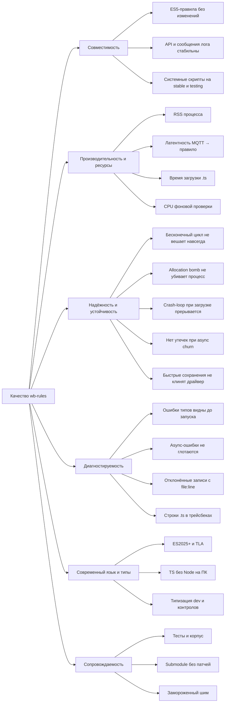

# 10. Требования к качеству

Конкретизация целей качества из [§1.2](01-introduction-goals.md). Числа — измеренные
(источник и условия указаны в каждой строке); где измерения нет — «уточнить».

## 10.1. Дерево качества

## 10.2. Сценарии качества

Формат: стимул → реакция системы → метрика / измеренное значение. Условия измерений:
WB8 (arm64, Debian trixie), 2026-08-13, одинаковый набор правил, если не указано иное.

| # | Качество | Стимул (источник) | Реакция системы | Метрика, измеренное значение |
|---|---|---|---|---|
| Q1 | Совместимость | Загружены все правила контроллера WB8 после обновления с 2.46.x (Duktape) на 3.0.0~quickjs | Все файлы загружаются, правила срабатывают как прежде | 0 script errors на продуктивном наборе WB8; внутренний корпус скриптов: **508 ok / 5 module-missing / 150 script-side** ошибок (ошибки самих скриптов: синтаксис, отсутствующие модули — не движка), **0 падений** движка (`corpus-verdicts.txt`) |
| Q2 | Совместимость | Тест-сьюты wb-rules на production `wbgo.so` | Все сьюты зелёные без изменения семантики | 36/36 исходных сьютов (2026-08-13); число Go test-функций выросло примерно вдвое (async, TLA, leak, editor, TS, corpus-regress; плюс ~30 тестов шима); задокументированные отличия — см. раздел 8.6 (строка `defineRule` 24→17, неперечислимые поля `StorableObject`, UTF-8 в логе, зарезервированный `await`, параметр `exports`, приближённые `jx`/`jc`, нестрогий base64, `Duktape.dec` возвращает строку вместо буфера, проброс исключений геттеров при конвертации как `Error`, ошибка на несериализуемое значение в `PersistentStorage`) |
| Q3 | Ресурсы | Установившийся режим, тот же набор правил | RSS не хуже Duktape-версии | RSS **37.6 МБ (Duktape 2.46.2) → 36.7 МБ (QuickJS)**, PSS 36.1 → 35.3 МБ |
| Q4 | Производительность | Публикация в контрол, правило пишет ответ в другой контрол (n=300) | Реакция в единицах мс | медиана **6.98 → 7.61 мс**, p99 12.3 → 14.7 мс (+0.6 мс на интерпретаторе без JIT — приемлемо для MQTT-bound правил) |
| Q5 | Производительность | ES5-вычислительный бенчмарк (`sample-bench.js`: цикл 2M итераций + fib(23)) | Быстрее Duktape | **~1300 мс → ~310 мс (×4.2)** |
| Q6 | Производительность | Сохранение `.ts` из редактора | Файл запускается без ожидания проверки типов | транспиляция **≈1 мс** (warm `tsgo --api`, 0.3–1.3 мс); фоновая проверка **≈0.27 с/файл, 0.34 с на 20 файлов батчем** (300 мс окно, ≤2 процесса), не блокирует engine loop |
| Q7 | Устойчивость | Правило с синхронным бесконечным циклом (`while (sleep(1000)) {}` без `await`; кейс из корпуса `while(true)`) | Цикл прерывается, остальные правила продолжают работать, процесс жив | watchdog **10 с** (`-js-timeout`, `DEFAULT_JS_EXECUTION_LIMIT`), лог `execution timed out: exceeded the 10s js-timeout (infinite or non-awaiting loop?)` + трейсбек; окно взводится и на каждый promise job; контекст остаётся рабочим (`TestRunawayScriptInterrupted`, `TestExecutionTimeLimitInPromiseJob`) |
| Q8 | Устойчивость | Allocation bomb в правиле | Catchable OOM в сбойном скрипте, не OOM-kill процесса | `JS_SetMemoryLimit` **512 МиБ** (`-js-memory-limit`); после исключения контекст пригоден (`TestMemoryLimit`); внешняя ограда systemd `MemoryMax=50%` |
| Q9 | Устойчивость | Файл, роняющий процесс при загрузке (panic в Go-пути) | Crash-loop прерывается, редактор остаётся доступен | loadguard: карантин после **3 подряд падений** (`LOAD_CRASH_QUARANTINE_THRESHOLD`), маркер `wbrules-loading.marker`, снятие карантина при смене mtime; `CallSync` в debug больше не паникует через 120 с |
| Q10 | Устойчивость | Пользователь 110 раз подряд нажимает «Сохранить» (каждое сохранение = remove+recreate vdev) | Нет «Device with given ID already exists», карты драйвера согласованы | стоковый драйвер клинил на ~40 RPC-save; с wbgo-private #100 — **110 сохранений, 0 ошибок** |
| Q11 | Устойчивость | 5000 итераций async-churn (промисы, таймеры, `changed`/`nextMqtt` с таймаутом, realm'ы с вечно-pending промисами) | Память стабильна, waiter'ы вычищаются | рост heap **≤256 КБ** (`TestAsyncChurnMemoryStable`), map tracker'а дренируется, realm'ы освобождаются; `TestTimedOutWaitersReclaimed` event-gated |
| Q12 | Диагностируемость | В `.ts` написано `dev["buzzer/enabled"] = 123` при типе `switch`; в `.js` — опечатка `whenChanger` | Ошибка видна в редакторе и в логе до/независимо от запуска | `TS check: file:line:col: …` в `/wbrules/log/warning` (≤10 строк/файл), `Editor.Check` → squiggle у строки; для `.js` — warning (advisory, `checkJs`), шумовые коды 2362/2363/2410/2703 отброшены; 172/508 legacy-файлов корпуса получают ≥1 диагностику (в основном TS2304) — ожидаемо |
| Q13 | Диагностируемость | `throw` после `await` в `then` правила | Ошибка не глотается | `async rule error: <msg> (stack)` в `/wbrules/log/error` через rejection tracker (`TestUnhandledRejectionReported`, `TestHandledRejectionNotReported`); runtime-ошибки с `path:line` показываются в редакторе как lint-диагностики |
| Q14 | Диагностируемость | `getControl("d/c").setValue("123")` в контрол типа `value` | Запись отклонена видимо, кэш не отравлен | `control d/c: write ignored (...) at /etc/wb-rules/foo.js:14` в консоли homeui; исключение не бросается (совместимость, ADR-009) |
| Q15 | Диагностируемость | Ошибка в `.ts`-файле | Трейсбек указывает строку `.ts`, а не сгенерированного JS | source map V3 → `lineMaps` → `TranslateLine`; `TSSyntaxError{Line}` якорит ошибку загрузки к строке `.ts` |
| Q16 | Язык и типы | Правило использует классы, `let`/`const`, стрелки, `Object.groupBy`, `toSorted`, top-level `await`, `Promise.withResolvers` | Выполняется без транспиляции | полный ES2025, 6 из 7 фич ES2026 (нет `Array.fromAsync`); `sample-es2026.js`, `sample-async.js`, `testrules_ts_tla.ts` |
| Q17 | Язык и типы | Новая установка: `apt install wb-rules` | TS доступен сразу, `.ts` не падают при первом старте | `Depends: wb-tsgo` (порядок configure), per-operation `Available()`, `Untrack` при неудачной загрузке — регресс 2026-08-15 (Recommends) закрыт (`TestNoTsgo`, `TestLateTsgo`) |
| Q18 | Редактор | Открытие файла в homeui | Подсказки и ошибки без обращения к ПК | языковой сервис в браузере (lazy-chunk ~1 МБ gzip), типы от `Editor.GetTypes` (таймаут 3 с → vendored fallback), реестр из `devicesStore`; опрос `Editor.Check` с нарастающим интервалом (700 мс → 2 с, около минуты); homeui — **2418 vitest-тестов** зелёные |
| Q19 | Сопровождаемость | Обновление QuickJS / typescript-go | Без патчей upstream | submodule `3d5e064` байт-в-байт = tarball 2026-06-04; `wb-tsgo` собирает немодифицированный typescript-go; поверхность шима не растёт (новые API — `lib.js`) |
| Q20 | Ресурсы (CI) | Прогон тестов | Быстро, изолированно | `TestCorpus` ≈5 с на 8 шардах (~2 мин вместо 40+), `spawn` заглушен (`SetSpawnFunc`) — скрипты корпуса не запускают внешние команды на хосте |

## 10.3. Не измерено / уточнить

- Скорость `tsgo` (транспиляция и проверка) на armhf WB6/WB7 — не проверялась; целевые
  значения Q6 относятся к WB8.
- CPU-нагрузка при >~200 публикаций/с (README: деградация) — перемерить на QuickJS
  (YouTrack SOFT-5997).
- Порог p99 латентности как формальное требование не задан; текущее значение (14.7 мс)
  принято как базовая линия.
- Время холодного старта сервиса с несколькими десятками `.ts`-файлов (батч-проверка
  при старте) — уточнить на контроллере.
